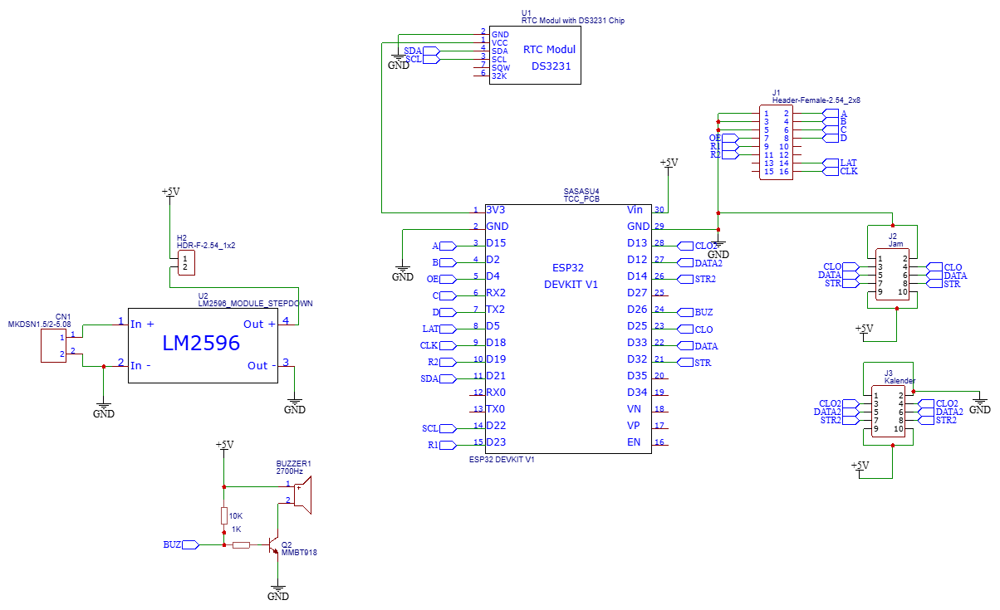

# Smart JWS Controller - ESP32, Matrix P4.75 & 7-Segment Sync

## Table of Contents
- [Introduction](#introduction)
- [Features](#features)
- [Installation](#installation)
- [Schematic](#schematic)
- [Usage](#usage)
- [Author](#author)

## Introduction
Proyek ini adalah sistem kontrol **Jadwal Waktu Sholat (JWS)** berbasis ESP32 yang dirancang khusus untuk panel LED Matrix P4.75 (F70) dan 7-segment eksternal.

## Features
- **🚀 Zero-Blank Transition**: Algoritma deteksi `;` untuk transisi teks instan.
- **🔄 Intelligent Sync System**: Sinkronisasi kedip antara Matrix dan 7-Segment.
- **🌙 Auto-Stealth Mode**: Mematikan display jadwal saat fase Iqomah dan Sholat.
- **📶 WiFi Monitoring**: Indikator "CONNECT" otomatis saat konfigurasi via HP.

## Installation

### Hardware Connection
Sistem ini menggunakan ESP32 DevKit V1 sebagai otak utama dengan pembagian jalur data sebagai berikut:
1. **Matrix P4.75 (J1)**: Menggunakan jalur data A, B, C, D, OE, LAT, CLK, R1, R2.
2. **7-Segment Kalender (J3)**: Dikontrol melalui jalur `DATA2`, `CLO2`, dan `STR2`.
3. **7-Segment Jam Utama (J2)**: Dikontrol melalui jalur `DATA`, `CLO`, dan `STR`.
4. **RTC DS3231**: Terhubung via I2C (`SDA` Pin 21, `SCL` Pin 22).

## Schematic
Berikut adalah diagram koneksi lengkap berdasarkan skematik sistem:

> **Note:** Pastikan menggunakan modul Stepdown LM2596 untuk menyuplai tegangan +5V yang stabil ke panel LED Matrix dan ESP32.

## Usage
- **Input Teks**: Akhiri pesan dengan `;` (contoh: `PESAN;`).
- **Buzzer**: Terhubung pada pin `BUZ` melalui transistor driver untuk penguat suara.
- **Mode Imsak**: Display akan berkedip selama 60 detik tanpa hitungan iqomah.

## Author
**Sinthato** [GitHub](https://github.com/Sinthato) | [LinkedIn](https://linkedin.com/in/sinthato)  
*Last Updated: 2026-03-14 06:52:12 (UTC)*
